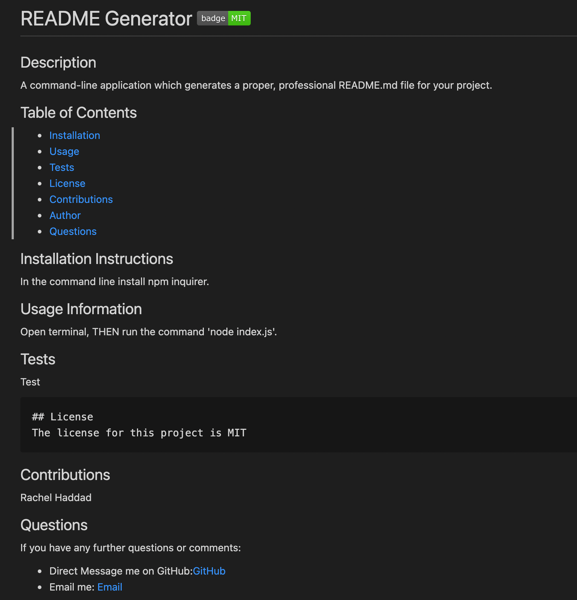

# README Generator

## Table of Contents

- [Description](./README.md#description)
- [Installation](./README.md#installation)
- [Usage](./README.md#usage)
- [Screenshots](./README.md#screenshots)
- [License](./README.md#license)
- [Author](./README.md#author)
- [Links](./README.md#links)
- [Questions](./README.md#questions)

## Description

A command-line application which generates a proper and professional README.md file for your project.

## Installation

In the command line run 'npm install inquirer'.

## Usage

Open terminal, then run the command 'node index.js'.

## Screenshots

## ||

- Here is the link to the instructional demo video: [Google Drive](https://drive.google.com/file/d/1UOGdfXhspS3Tv__zyORte3mCf6uoprSx/view?usp=sharing)

## License

This application is covered under MIT License.

## Author

Rachel Haddad

## Links

- Here is the repo: [Repo](https://github.com/buttercupsmom/readMeGen)

- Here is the page: [Page](https://buttercupsmom.github.io/readMeGen/)

## Questions

If you have any further questions or comments:

- Direct Message me on GitHub: [https://github.com/buttercupsmom](https://github.com/buttercupsmom)
- Email me: [yarkony.rachel@gmail.com](mailto:yarkony.rachel@gmail.com)
